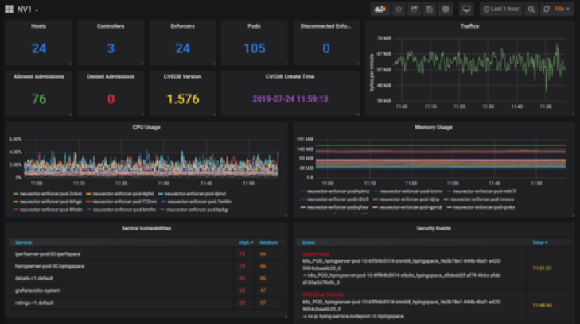

# Prometheus exporter and Grafana template



### NV_Exporter Setup:

- Clone the repository
- Make sure you installed Python 3 and python3-pip:
```
$ sudo apt-get install python3
$ sudo apt-get install python3-pip
```
- Install the Prometheus Python client:
```
$ sudo pip install -U setuptools
$ sudo pip install -U pip
$ sudo pip3 install prometheus_client requests
```
- Run exporter:
```
$ python3 nv_exporter.py -p [Exporter_Port] -s [Neuvector_API_Host:API_Port]
```
(example: $ python3 nv_exporter.py -p 1234 -s 10.1.22.11:30443, for more API targets: $ python3 nv_exporter.py -p 1234 -s 10.1.22.11:30443 -s 10.1.22.12:34567)

- Open browser, go to: [exporter_host]:[exporter_port] (example: 10.1.22.11:1234)
- If you can load the metric page, the exporter is working fine.

### Prometheus Setup:

- Add exporter target in your prometheus.yml file under `scrape_configs`:
```
global:
  evaluation_interval: 10s

scrape_configs:
  - job_name: prometheus
    scrape_interval: 10s
    static_configs:
      - targets: ["localhost:9090"]
  - job_name: nv-exporter
    scrape_interval: 30s
    static_configs:
      - targets: ["[exporter_host]:[exporter_port]"]
      (example: - targets: ["10.1.22.11:1234"])
```

- You can also change the scrape interval
- After deployed Prometheus, open browser and go to: Prometheus_Host:9090 (example: localhost:9090)
- On the top bar go to `Status -> Targets` to check exporter status. If the name is blue and `State` is `UP`, the exporter is running and Prometheus is successfully connected to the exporter.
- On the top bar go to `Graph` and in the `Expression` box type `nv` to view all the metrics the exporter has.

### Grafana Setup:
- After deployed Prometheus, open browser and go to: Grafana_Host:3000 (example: localhost:3000)
- Login and add Prometheus source, find the `+` on the left bar, select `Import`
- Upload NeuVector dashboard templet JSON file.
