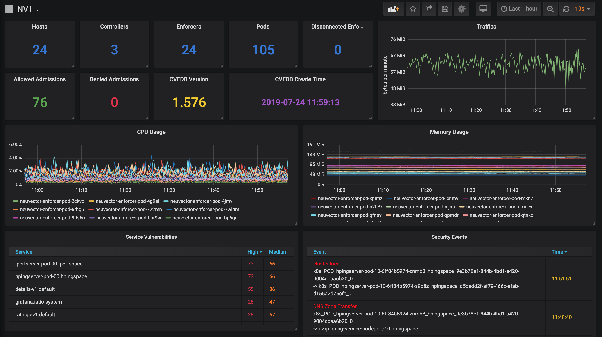

# Prometheus exporter and Grafana template



### NV_Exporter Setup:

#### To run the exporter as Python program
- Clone the repository
- Make sure you installed Python 3 and python3-pip:
```
$ sudo apt-get install python3
$ sudo apt-get install python3-pip
```
- Install the Prometheus Python client:
```
$ sudo pip3 install -U setuptools
$ sudo pip3 install -U pip
$ sudo pip3 install prometheus_client requests
```

#### To run the exporter and prometheus as a container
It's easier to start NeuVector exporter as a container. The following section describe how to start the exporter in the Docker environment. A kubernetes sample yaml file, nv_exporter.yml, is also included.

Modify both docker-compose.yml and nv_exporter.yml. Specify NeuVector controller's RESTful API endpoint `CTRL_API_SERVICE`, login username `CTRL_USERNAME`, password `CTRL_PASSWORD`, and the port that the export listens on through environment variables `EXPORTER_PORT`. **It's highly recommanded to create a read-only user account for the exporter.**


##### In native docker environment

Start NeuVector exporter container.
```
$ docker-compose up -d
```
- Open browser, go to: [exporter_host:exporter_port] (example: localbost:8068)
- If you can load the metric page, the exporter is working fine.


Add and modify the exporter target in your prometheus.yml file under `scrape_configs`:
```
scrape_configs:
  - job_name: prometheus
    scrape_interval: 10s
    static_configs:
      - targets: ["localhost:9090"]
  - job_name: nv-exporter
    scrape_interval: 30s
    static_configs:
      - targets: ["neuvector-svc-prometheus-exporter.neuvector:8068"]
```

Start Prometheus container.
```
$ docker run -itd -p 9090:9090 -v $(pwd)/prometheus.yml:/etc/prometheus/prometheus.yml --name prometheus prom/prometheus
```
- After deployed Prometheus, open browser and go to: [prometheus_host:9090] (example: localhost:9090)
- On the top bar go to `Status -> Targets` to check exporter status. If the name is blue and `State` is UP, the exporter is running and Prometheus is successfully connected to the exporter.
- On the top bar go to `Graph` and in the `Expression` box type `nv` to view all the metrics the exporter has.

##### In Kubernetes
Start NeuVector exporter pod and service.
```
$ kubectl create -f nv_exporter.yml
```

Create configMap for Prometheus scrape_configs.
```
$ kubectl create cm prometheus-cm --from-file prom-config.yml
```

Start Prometheus pod and service.
```
$ kubectl create -f prometheus.yml
```


### Grafana Setup:
- Start Grafana container. "docker run" example,
```
$ sudo docker run -d -p 3000:3000 --name grafana grafana/grafana
```
- After deployed Grafana, open browser and go to: [grafana_host:3000] (example: localhost:3000)
- Login and add Prometheus source, find the `+` on the left bar, select `Import`
- Upload NeuVector dashboard templet JSON file.
